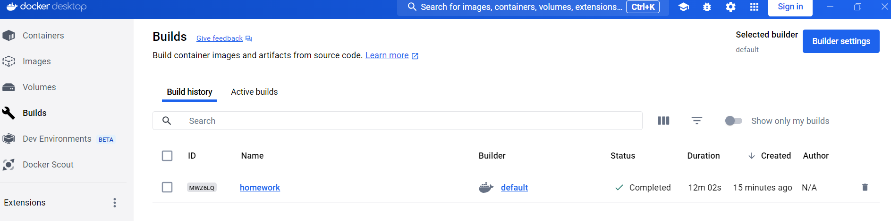
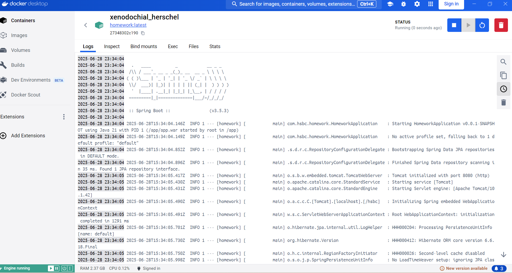

1: Using Spring-Cache as the in memory Cache.  
2: Using H2 as memory DB, also enable H2 paging.  
3: Can review H2 in http://localhost:8080/hsbc/h2-console once the application start.   
4: Enable unit test and performance test.  
5: Enable exception with advice.  
6: Containerization with docker, can do docker build on local server:  
  

API call example(can be accessed by postman):  
POST:http://localhost:8080/hsbc/api/transaction
{
"name": "t-1",
"type": "buy",
"amount": 128.50
}

//Show all transactions with paging   
GET:http://localhost:8080/hsbc/api/transactions/page

//Show all transactions  
GET:http://localhost:8080/hsbc/api/transactions

//Get transaction by id  
GET:http://localhost:8080/hsbc/api/transaction/id/1

//Get transaction by name  
GET:http://localhost:8080/hsbc/api/transaction/name/myt

//Update transaction by id  
PUT:http://localhost:8080/hsbc/api/transaction/1
{
"name": "t-update",
"type": "sell",
"amount": 129.50
}

//Delete transaction by id  
DELETE:http://localhost:8080/hsbc/api/transaction/1